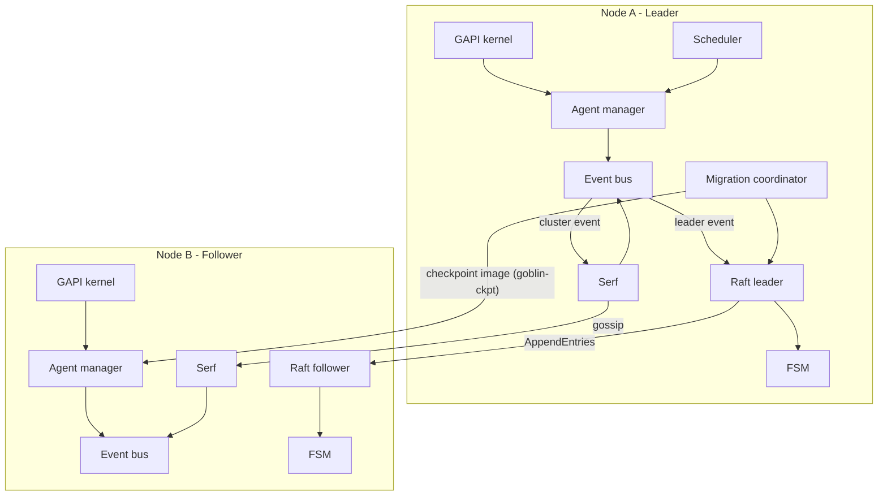

# Goblin Architecture

Goblin is the **distributed supervisor** of the GoPPydae ecosystem. It
adds cluster coordination, global scheduling and multi-node resilience
on top of GAPI's local supervision.

## Design philosophy

**Goblin = GAPI + clustering.** Goblin does not reinvent agent
supervision. It:

1. Embeds the GAPI kernel (`gapi/core/*`) for local agent management.
2. Adds distributed primitives: consensus (Raft), membership (Serf), a
   distributed event bus.
3. Provides global scheduling with redundancy, failover and live
   migration.

The split is mechanism versus policy. GAPI knows how to start, stop,
signal and checkpoint a process on one machine. Goblin decides which
machine, and what happens when that changes.

## Relationship to GAPI

```
+---------------------------------+
|      Goblin node (goblind)      |
+---------------------------------+
|  Cluster components             |
|  - Serf (membership/gossip)     |
|  - Raft (consensus/leader)      |
|  - Distributed event bus        |
|  - Global scheduler             |
|  - Migration coordinator        |
+---------------------------------+
|  GAPI kernel (embedded)         |
|  - agentmgr   - lifecycle       |
|  - procsig    - checkpoint      |
+---------------------------------+
|  Local agents (ADK)             |
+---------------------------------+
```

Each Goblin node runs GAPI's agent manager **in process**. There is no
separate GAPI daemon.

## Core components

### 1. Cluster membership (Serf)

Maintains the live node list and detects failures.

- **Technology**: Serf (SWIM-style gossip), carried over QUIC.
- **Discovery**: nodes find each other through `--join`.
- **Failure detection**: randomized probing.
- **User events**: the event bus's cluster scope. Fast, eventually
  consistent.

### 2. Consensus (Raft)

Provides strong consistency for state that cannot be eventually
consistent.

- **Technology**: `hashicorp/raft`, carried over QUIC.
- **Leader election**: one node leads; only the leader accepts writes.
- **Log replication**: commands are committed to a replicated FSM.

The FSM is **not** just a key-value store. It dispatches nine command
types (`core/consensus/fsm.go`):

| Command | Purpose |
| ------- | ------- |
| `SET`, `DELETE`, `CAS` | the generic KV namespace |
| `ADMIT` | admit an instance, minting its UUID at propose time |
| `TRANSITION` | lifecycle state changes, illegal ones rejected |
| `SIGNAL` | authorize and audit a signal before delivery |
| `MIGRATE_BEGIN`, `MIGRATE_COMMIT` | live migration intent and outcome |
| `UNSPECIFIED` | rejected loudly - never misapplied |

Instance identity lives here and is immutable. Instance *location* does
not: it lives in gossip, because it changes on every restart and
migration.

### 3. Distributed event bus

Wraps the embedded GAPI event bus and routes by intent:

| Scope | Method | Transport | Consistency | Example |
| ----- | ------ | --------- | ----------- | ------- |
| Local | `PublishLocal()` | memory | none | `agent.started` |
| Cluster | `PublishCluster()` | Serf gossip | eventual | `node.joined` |
| Leader | `PublishLeader()` | Raft log | strong | `job.assign` |

### 4. Transport: one port, five protocols

Everything shares a single QUIC listener, routed by TLS ALPN. There are
no separate Serf, Raft or API ports.

```
QUIC listener :29000
|-- ALPN "gapi-quic"     -> embedded GAPI kernel protocol
|-- ALPN "goblin-rpc"    -> goblinctl and scheduler RPC
|-- ALPN "serf-quic"     -> membership gossip
|-- ALPN "raft-quic"     -> Raft replication
`-- ALPN "goblin-ckpt"   -> CRIU checkpoint images (migration)
```

The registry is `core/transport/alpn.go`; the listener's view of it is
`registryALPNs` in `core/transport/listener.go`. Adding a row is a
registry change, and an ALPN with no adapter registered is refused with
`CodeALPNNotServing` rather than silently accepted.

`goblin-ckpt` is deliberately its own ALPN, and therefore its own QUIC
connection: a multi-gigabyte memory image sharing a connection-level
flow-control window with Raft heartbeats would degrade the control
plane exactly while a migration is in flight.

- **Security**: TLS 1.3. Without `--tls-cert`/`--tls-key` the daemon
  generates an ephemeral self-signed certificate and does not verify
  peers; `--production` refuses to start in that state.
- **Framing**: 1-byte stream type, 4-byte length, protobuf payload.

**Why one port**: simpler firewall rules, one certificate, stream
multiplexing, and ALPN doing the routing.

### 5. RPC surface

Two services ride `goblin-rpc`, registered in
`internal/supervisor/quic_handlers.go`:

- **`SchedulerRPC`** - cluster operations through the leader:
  `SubmitJob`, `DrainNode`, `MigrateJob`, `MigrateInstance`, `ListJobs`,
  `Members`, `GetEvents`, `PublishEvent`, `SignalAgentInstance`,
  `ListAgentInstances`, `RegisterGlobalAgent`, `ListGlobalAgents`,
  `GetGlobalAgent`, `ScaleAgent`, `DeleteGlobalAgent`,
  `ListLocalAgents`.
- **`NodeRPC`** - node-local execution of the leader's decisions:
  `StartAgentInstance`, `StopAgentInstance`, `SignalAgentInstance`,
  `CheckpointAgentInstance`, `RestoreAgentInstance`, `PullCheckpoint`.

Every mutating verb is authorized against a capability token scoped to a
named subject, and the authorization is audited through Raft.

## Live migration

Moving a running process between nodes, with its memory intact and its
instance UUID unchanged. The PID changes; the identity does not.

The sequence, driven by the coordinator on the leader
(`core/migration/coordinator.go`):

1. `MIGRATE_BEGIN` commits the intent. This is also the concurrency
   gate: the FSM refuses a second migration of the same instance.
2. The source checkpoints the instance with CRIU. The process is
   **stopped** by this - the image is the rollback artifact, and a
   source that kept running would have diverged from it.
3. The destination **pulls** the image over `goblin-ckpt`, keyed by
   `{instance_uuid, checkpoint_epoch}`. Pull, not push, so retry and
   backpressure sit with the node that will run the instance next
   rather than the one being torn down.
4. The destination restores from the image and adopts the process.
5. `MIGRATE_COMMIT` records the outcome and moves the instance's
   `node_id`.

The instance's lifecycle state stays `RUNNING` throughout. Migration is
a **locator** event, not a lifecycle event, so the lifecycle FSM stays
monotonic and its append-only tombstone model is undisturbed.

On failure after the dump, the source is restored from the same image
and the migration commits as `ABORTED`. If that rollback also fails the
instance is running nowhere, and the error says so distinctly - the two
outcomes need different responses from an operator.

## Data flow

**Member join**: node starts, initializes Serf, joins existing members;
Serf emits `EventMemberJoin`; the bus publishes `cluster.node.joined`
locally on every node.

**Leader election**: nodes bootstrap Raft, vote, elect a leader; the
leader begins applying FSM commands.

**Event propagation**:

- *Gossip*: `PublishCluster(topic, data)` - Serf broadcasts, every node
  unpacks and republishes locally.
- *Consensus*: `PublishLeader(cmd, data)` - forwarded to the leader,
  applied through Raft, and the FSM on every node updates.

## Diagram



## Local agent communication

The GAPI kernel runs in process, so there is no network hop for local
supervision: agents talk to the kernel by direct call, and the kernel
reaches the scheduler over the in-memory event bus.
